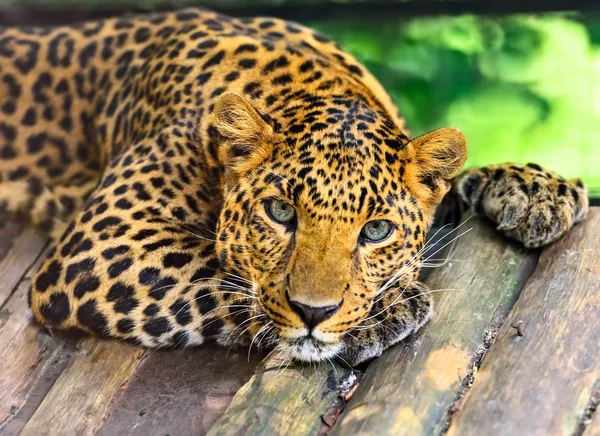
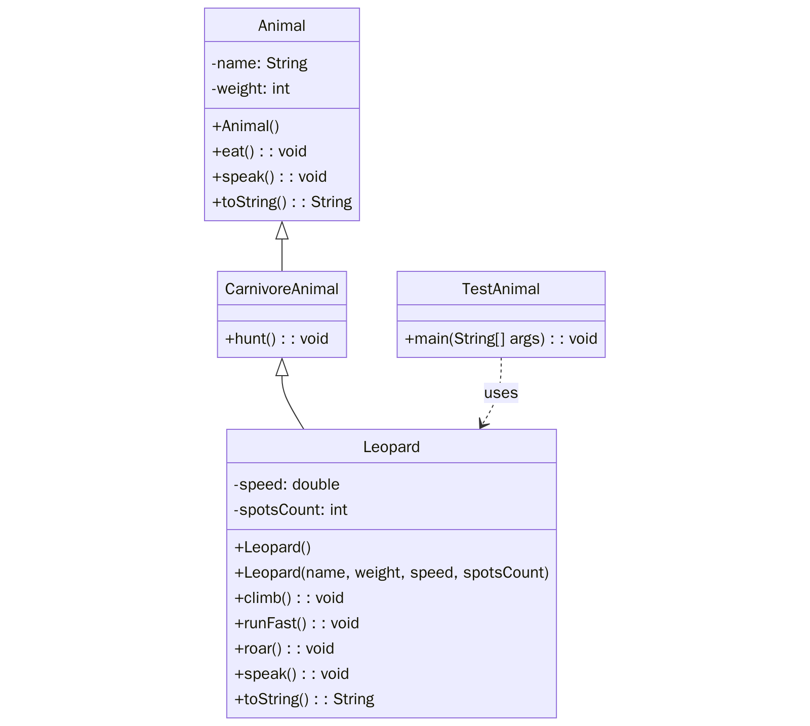

# Практична робота "Реалізація успадкування"
Цей репозиторій містить приклад виконання та інструкції для виконання практичної роботи з наслідування в JAVA. 

## 🐆 Леопард

**Леопард** — це хижий ссавець родини котових.  
Він володіє чудовими здібностями до лазіння, швидко бігає, полює здебільшого вночі, живе на самоті, має гострий зір і слух.  
Леопарди — універсальні хижаки, здатні пристосовуватись до різних середовищ існування.

---

## 🧠 Структура класів

Animal (тварина)

🔹 Абстрактний базовий клас  
🔹 Поля: name, weight  
🔹 Методи: eat(), speak(), toString()

CarnivoreAnimal (м'ясоїдна тварина)

🔹 Наслідує Animal  
🔹 Метод: hunt()

Leopard (леопард)

🔹 Наслідує CarnivoreAnimal  
🔹 Додаткові поля: speed, spotsCount  
🔹 Методи: climb(), runFast(), roar()

TestAnimal

🔹 Має метод main(String[] args)  
🔹 Використовує клас Leopard

## Діаграма класів

 

## Результат виконання програми

